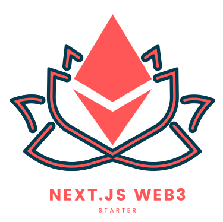

<p align="center"></p>
<h2 align="center">Bundles Bets Frontend</h2>

# Instructions

## Project structure

- **components** contains generic components used inside the application.
- **config** contains all the config files of contract.
- **redux** contains the redux files for the global state of the app.
- **context** contains global contexts (separated from the redux store)
- **hooks** contains generic hooks.
- **utils** contains generic utilities functions.

### Contracts

Add your ABIs to the `abis/` folder and run `yarn run generate` to generate the types for those abis. The generated types will be available in the `types/` directory.

To access the contract instances, add the contracts to the `config.ts` file in the following format to the `contracts` array.

```JavaScript
import { abi as ContractABI } from 'abis/Contract.json'

export const contractAddress = {
  ContractName: '',
  // more addresses
};

export const contracts: ContractConfig[] = [
  {
    name: 'ContractName',
    abi: ContractABI,
    address: contractAddress.ContractName,
  },
  // more contracts
]
```

For types support, import the generated types of the contract ABIs you want to use and add it to the `ContractInstances` interface like:

```javascript
export interface ContractInstances {
  ContractName: TYPE;
}
```

You can access the contract instances from the `instances` property of the `Contracts` class.

```JavaScript
import Contracts from 'helpers/contracts';

const contracts = Contracts.instances;
contracts.ContractName.method()
```

### Restricting Access to Chains

If you'd like to restrict the app to certain chains, you can add the chain id of that chain in the following format in the `config.ts` file to the `allowedChains` array.

If the array is empty, the app will not be restricted to any chain.

```JavaScript
export const allowedChains: AllowedChainConfig[] = [
  { id: ChainID, name: 'ChainName' },
  // more chains
];
```

### Metamask Context

- `account`: The account that is currently selected in the Metamask.

- `connect`: Connects the app to the Metamask.

- `discconect`: Disconnects the app from the Metamask.

- `isConnectedToAllowedNetwork`: Checks if the Metamask is connected to the allowed network.

- `handleTransactionError`: Use this function to handle transaction (contract interaction) errors.

- `refresh`:
  - `rerender`: Use this function to force re-render the appliction.
  - `triggerValue`: Include this as an dependency to hooks like the `useEffect` if required. This value will change when the user changes the network, account and when `rerender` is called, thus triggering the hook.

# Available Scripts

In the project directory, you can run:

### `yarn run dev`

Runs the app in the development mode.\
Open [http://localhost:3000](http://localhost:3000) to view it in the browser.

The page will reload if you make edits.\
You will also see any lint errors in the console.

### `yarn run build`

Builds the app for production to the `build` folder.\
It correctly bundles React in production mode and optimizes the build for the best performance.

The build is minified and the filenames include the hashes.\
Your app is ready to be deployed!

### `yarn run start`

Runs the app in the production server.\
